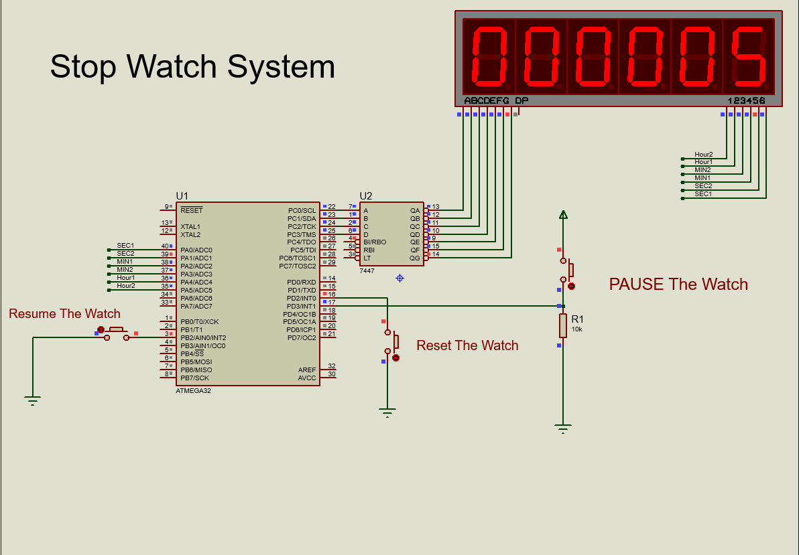

# Stop-Watch
Developing a system that control the stop-watch time and display it on 7-segments.

Developing a system that control the stop-watch time and display it on 7-segments.
Drivers        : GPIO, Timer, External Interrupts and 7-Segement 
Microcontroller: ATmega32.

